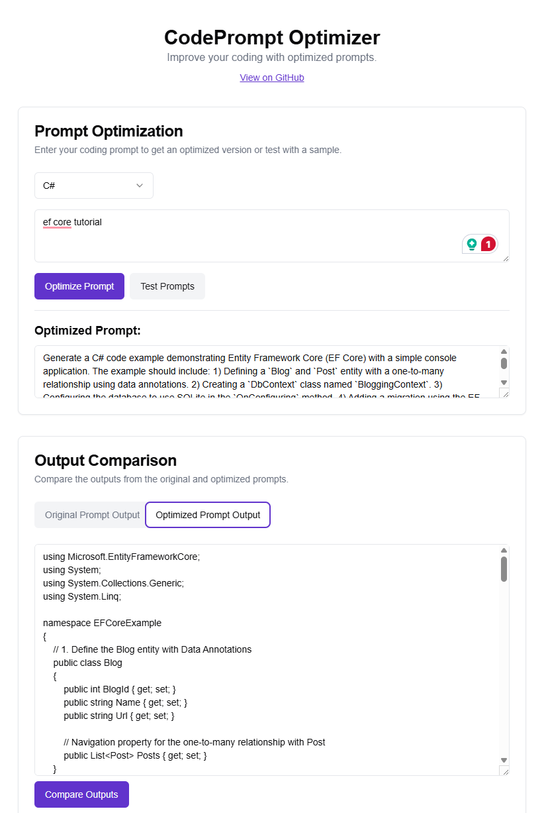

# CodePrompt Optimizer

> 🚀 This project was generated using Firebase Studio


A Next.js (App Router) + React application for optimizing and comparing AI-generated code prompts. Quickly refine your prompts, test them, and compare outputs side-by-side to find the best-performing prompt for your coding tasks.



## Features

- **Prompt Optimization**: Refine your initial code prompt using an AI-powered optimization flow.
- **Sample Testing**: Generate code outputs from both original and optimized prompts.
- **Output Comparison**: Compare side-by-side outputs and view a summary of key differences.
- **Multi-language Support**: Choose from common programming languages like C#, Python, JavaScript, TypeScript, Java, C++, and Go.
- **Live Toast Notifications**: Get real-time feedback on actions (optimize, test, compare).
- **Easy Navigation**: GitHub link in header for quick access to source.

## Demo

You can view a live demo or run locally:

- **Live Demo**: https://codeprompt.blazorserver.com/
- **GitHub**: https://github.com/neozhu/codeprompts-optimizer

## Installation

1. **Clone the repository**
   ```bash
   git clone https://github.com/neozhu/codeprompts-optimizer.git
   cd codeprompts-optimizer
   ```

2. **Install dependencies**
   ```bash
   npm install
   # or
   yarn install
   ```

3. **Setup environment**
   Create a `.env.local` file in the project root:
   ```env
   NEXT_PUBLIC_OPENAI_API_KEY=your_openai_api_key
   ```

4. **Run in development**
   ```bash
   npm run dev
   # or
   yarn dev
   ```

   The app will be available at `http://localhost:3000/`.

## Usage

1. **Select a language** from the dropdown (default: C#).
2. **Enter your coding prompt** in the text area.
3. **Optimize Prompt** to generate a refined AI prompt.
4. **Test Prompts** once the optimized prompt appears to see both outputs.
5. **Compare Outputs** to get a summary of differences.


## Project Structure

```
├── app/                   # Next.js App Router pages
│   └── page.tsx           # Home page component
├── components/            # Reusable UI components
│   ├── ui/                # Tailwind-based UI primitives
│   └── ...
├── ai/                    # AI flow definitions (optimize, generate, summarize)
├── hooks/                 # Custom React hooks (e.g., use-toast)
├── public/                # Static assets (icons, images)
├── styles/                # Global CSS / Tailwind config
└── README.md              # This file
```

## Contributing

Contributions are welcome! Please open an issue or submit a pull request:

1. Fork the repo
2. Create a new branch (`git checkout -b feature/YourFeature`)
3. Commit your changes (`git commit -m 'Add YourFeature'`)
4. Push to branch (`git push origin feature/YourFeature`)
5. Open a Pull Request


## License

This project is licensed under the MIT License. See [LICENSE](LICENSE) for details.

---

_Developed by [neozhu](https://github.com/neozhu)_

